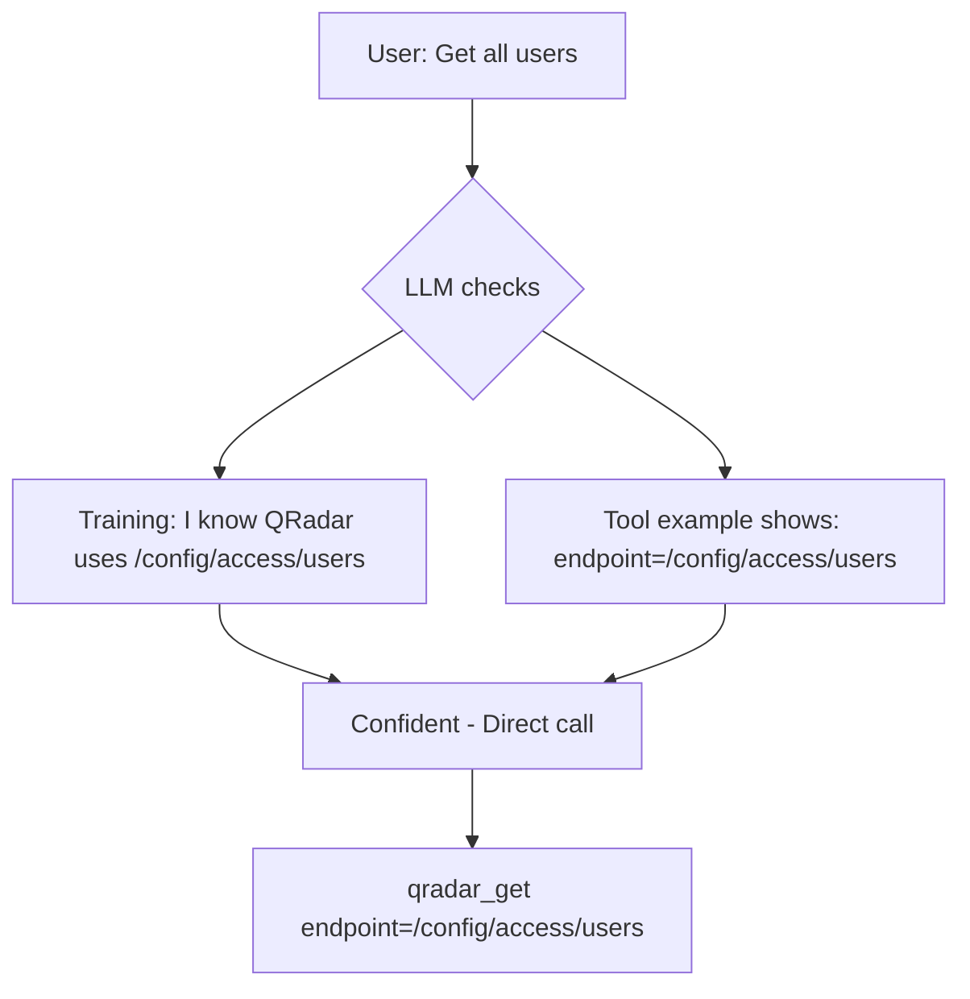

# QRadar MCP Server - Architecture & Token Efficiency

## Overview

The QRadar MCP Server uses **4 generic tools** to provide access to all **728 QRadar API endpoints**. This architecture is optimized for token efficiency and scalability.

---

## The 4 Tools

| Tool | Coverage | Purpose |
|------|----------|---------|
| `qradar_get` | 414 endpoints | Fetch any data (GET requests) |
| `qradar_execute` | 227 endpoints | Create/Update anything (POST/PUT/PATCH requests) |
| `qradar_delete` | 87 endpoints | Delete any resource (DELETE requests) |
| `qradar_discover` | Schema lookup | Find endpoints + parameters dynamically |

**Total: 4 tools → 728 endpoints**

---

## Token Consumption

### How MCP Tool Calling Works

Every time a user sends a message, the LLM receives:
1. **ALL tool definitions** (so LLM can choose which tool to use)
2. **User's message**
3. **Conversation history**

The LLM cannot choose a tool it doesn't know about - it must see all available tools.

### Token Usage

| Component | Tokens |
|-----------|--------|
| 4 Tool Definitions | ~1,000 tokens |
| User Message | ~20-100 tokens |
| **Total per message** | **~1,000-1,500 tokens** |

### Multi-Message Conversation

| Messages | Tool Tokens | Message Tokens | Total |
|----------|-------------|----------------|-------|
| 1 | 1,000 | 100 | 1,100 |
| 5 | 5,000 | 500 | 5,500 |
| 10 | 10,000 | 1,000 | 11,000 |

> **Note:** Tool definitions are sent on every message because the LLM needs to see all options to make a selection.

---

## How LLM Identifies the Correct Endpoint

**Question:** When user asks "Get all users", how does the LLM know to use endpoint `/config/access/users`?

**Answer:** The LLM uses its training knowledge combined with examples we provide in the tool description. For unknown endpoints, it uses `qradar_discover`.

### What Happens When User Makes a Query



### Common Queries - Direct Call

For common queries like offenses, users, rules:
- LLM knows the endpoint from training on QRadar documentation
- Tool description has examples confirming the format
- LLM makes direct call without needing discover

**Example:**
```
User: "Show me all offenses"

LLM knows: QRadar offenses are at /siem/offenses
Tool example confirms: endpoint="/siem/offenses"

Output: qradar_get(endpoint="/siem/offenses")
```

### Obscure Queries - Discover First

For obscure endpoints (QNI, disaster recovery, etc.):
- LLM may not know the exact path
- LLM calls `qradar_discover` first
- Then uses the discovered endpoint

**Example:**
```
User: "Get QNI host configurations"

LLM doesn't know this endpoint
Step 1: qradar_discover(search="qni host")
Step 2: Returns {path: "/qni/hosts/{id}/configs"}
Step 3: qradar_get(endpoint="/qni/hosts/1/configs")
```

### Tool Description with Examples

We provide examples in each tool description to guide the LLM:

```
Tool: qradar_get
Description: "Fetch data from QRadar.

Examples:
- List offenses: endpoint="/siem/offenses"
- Get offense by ID: endpoint="/siem/offenses/123"
- List users: endpoint="/config/access/users"
- System info: endpoint="/system/about"
"
```

When user asks "Get all users", LLM sees the example `endpoint="/config/access/users"` and uses that exact format.

---

## Tool Details

### qradar_get (414 endpoints)

**Purpose:** Fetch data from QRadar using GET requests.

| Parameter | Type | Required | Description |
|-----------|------|----------|-------------|
| endpoint | string | Yes | API path (e.g., "/siem/offenses") |
| filter | string | No | AQL filter expression |
| fields | string | No | Fields to return |
| range | string | No | Pagination (e.g., "0-49") |

**Examples:**
```
qradar_get(endpoint="/siem/offenses")
qradar_get(endpoint="/siem/offenses/123")
qradar_get(endpoint="/siem/offenses", filter="status=OPEN")
qradar_get(endpoint="/config/access/users")
```

### qradar_execute (227 endpoints)

**Purpose:** Create or modify resources using POST/PUT/PATCH requests.

| Parameter | Type | Required | Description |
|-----------|------|----------|-------------|
| method | string | Yes | HTTP method (POST, PUT, PATCH) |
| endpoint | string | Yes | API path |
| params | object | No | Query parameters |
| body | object | No | Request body |

**Examples:**
```
qradar_execute(method="POST", endpoint="/ariel/searches", params={"query_expression": "SELECT * FROM events"})
qradar_execute(method="POST", endpoint="/reference_data/sets", params={"name": "blocked_ips", "element_type": "IP"})
```

### qradar_delete (87 endpoints)

**Purpose:** Remove resources using DELETE requests.

| Parameter | Type | Required | Description |
|-----------|------|----------|-------------|
| endpoint | string | Yes | API path with resource ID |

**Examples:**
```
qradar_delete(endpoint="/reference_data/sets/blocked_ips/192.168.1.100")
qradar_delete(endpoint="/ariel/saved_searches/123")
```

### qradar_discover (Schema lookup)

**Purpose:** Find QRadar API endpoints and their schemas dynamically.

| Parameter | Type | Required | Description |
|-----------|------|----------|-------------|
| search | string | Yes | Search term for path/description |
| method | string | No | Filter by HTTP method |
| limit | integer | No | Max results (default: 10) |

**Examples:**
```
qradar_discover(search="user")
qradar_discover(search="reference_data", method="POST")
qradar_discover(search="offense")
```

---

## Summary

| Aspect | Value |
|--------|-------|
| Total Tools | 4 |
| Total Endpoints Covered | 728 |
| Tokens per Message | ~1,000-1,500 |
| Endpoint Identification | Training + Examples + Discover (combined) |
