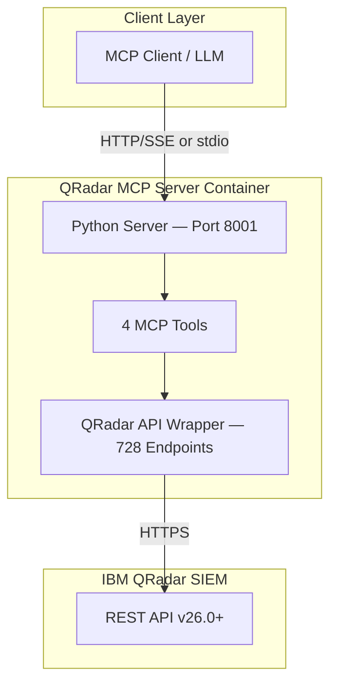

# QRadar MCP Server

**Model Context Protocol (MCP) server for IBM QRadar SIEM** — Access 728+ QRadar REST API endpoints through just 4 intelligent MCP tools.


---

## What is This?

QRadar MCP Server bridges **Large Language Models (LLMs)** and **IBM QRadar SIEM**. Instead of exposing 728 API endpoints as separate tools (which would overwhelm any LLM context window), this server consolidates them into **4 intelligent tools** — achieving a **96% reduction** in token usage.

| Traditional Approach | QRadar MCP Server |
|---------------------|-------------------|
| 728 tool definitions | **4 tool definitions** |
| ~50,000 tokens/request | **~2,000 tokens/request** |
| Context overflow risk | Fits any LLM context |

Works with any MCP-compatible client: Claude Desktop, custom AI agents, or direct HTTP calls.

---

## Quick Start

### Prerequisites

- **Docker** installed ([Get Docker](https://docs.docker.com/get-docker/))
- **QRadar Console** with API access enabled
- **QRadar API Token** — get it from: QRadar Console → Admin → Authorized Services → Add

### Step 1: Pull the Container

```bash
docker pull ghcr.io/ibm/qradar-mcp-server:latest
```

> Multi-arch image — works on Intel/AMD (x86_64) and Apple Silicon/ARM (aarch64).

### Step 2: Run the Container

```bash
docker run -d \
  --name qradar-mcp \
  -p 8001:8001 \
  -e QRADAR_HOST="https://your-qradar-console.com" \
  -e QRADAR_API_TOKEN="your-api-token" \
  -e QRADAR_VERIFY_SSL="false" \
  ghcr.io/ibm/qradar-mcp-server:latest
```

Replace:
- `your-qradar-console.com` with your QRadar console hostname
- `your-api-token` with your QRadar authorized service token

### Step 3: Verify

```bash
curl http://localhost:8001/health
```

Expected response:
```json
{"status": "healthy", "mode": "http", "tools": 4, "endpoints": 728}
```

That's it — the MCP server is running and ready to use.

---

## Using the MCP Server

### Available Tools

| Tool | Description | Use For |
|------|-------------|---------|
| `qradar_get` | Fetch data from any endpoint | Get offenses, assets, rules, searches |
| `qradar_execute` | Create or update resources | Create reference sets, post notes |
| `qradar_delete` | Remove resources | Delete notes, reference data |
| `qradar_discover` | Find the right endpoint | Search 728 endpoints by keyword |

### HTTP API Examples

**Discover endpoints:**
```bash
curl -X POST http://localhost:8001/tools/call \
  -H "Content-Type: application/json" \
  -d '{
    "name": "qradar_discover",
    "arguments": {"search": "offenses"}
  }'
```

**Get recent offenses:**
```bash
curl -X POST http://localhost:8001/tools/call \
  -H "Content-Type: application/json" \
  -d '{
    "name": "qradar_get",
    "arguments": {"endpoint": "/siem/offenses", "limit": 10}
  }'
```

**List all tools:**
```bash
curl http://localhost:8001/tools
```

### With Claude Desktop (stdio Mode)

Add to your Claude Desktop MCP config (`~/Library/Application Support/Claude/claude_desktop_config.json`):

```json
{
  "mcpServers": {
    "qradar": {
      "command": "docker",
      "args": [
        "run", "-i", "--rm",
        "-e", "QRADAR_HOST=https://your-qradar-console.com",
        "-e", "QRADAR_API_TOKEN=your-api-token",
        "-e", "QRADAR_VERIFY_SSL=false",
        "ghcr.io/ibm/qradar-mcp-server:latest",
        "--stdio"
      ]
    }
  }
}
```

Then ask Claude things like:
- *"Show me the top 10 open offenses"*
- *"What assets are in my network?"*
- *"Search for failed login events in the last hour"*

---

## Configuration

### Environment Variables

| Variable | Required | Default | Description |
|----------|----------|---------|-------------|
| `QRADAR_HOST` | Yes | — | QRadar console URL (e.g., `https://qradar.example.com`) |
| `QRADAR_API_TOKEN` | Yes | — | QRadar authorized service token |
| `QRADAR_VERIFY_SSL` | No | `false` | Verify SSL certificates |
| `QRADAR_API_VERSION` | No | `26.0` | QRadar API version |

### Runtime Modes

| Mode | Flag | Use Case |
|------|------|----------|
| HTTP/SSE (default) | `--host 0.0.0.0 --port 8001` | Containers, web clients, direct API |
| stdio | `--stdio` | Claude Desktop, local CLI tools |

---

## Build from Source

```bash
git clone https://github.com/IBM/qradar-mcp-server.git
cd qradar-mcp-server

# Build container
docker build -t qradar-mcp-server -f container/Dockerfile .

# Run
docker run -d --name qradar-mcp -p 8001:8001 \
  -e QRADAR_HOST="https://your-qradar.com" \
  -e QRADAR_API_TOKEN="your-token" \
  qradar-mcp-server
```

---

## Architecture


```mermaid
graph TB
    subgraph "Client Layer"
        A[MCP Client / LLM]
    end

    subgraph "QRadar MCP Server Container"
        B[Python Server — Port 8001]
        C[4 MCP Tools]
        D[QRadar API Wrapper — 728 Endpoints]
    end

    subgraph "IBM QRadar SIEM"
        E[REST API v26.0+]
    end

    A -->|HTTP/SSE or stdio| B
    B --> C
    C --> D
    D -->|HTTPS| E
```

### Supported QRadar API Categories (728 endpoints)

SIEM (offenses, sources, destinations) · Assets (model, vulnerabilities) · Analytics (rules, building blocks) · Ariel (AQL queries, searches) · Reference Data (sets, maps, collections) · Config (domains, log sources, users) · System (health, licensing, servers)

---

## IBM Public Repository Disclosure

All content in this repository including code has been provided by IBM under the associated open source software license and IBM is under no obligation to provide enhancements, updates, or support. IBM developers produced this code as an open source project (not as an IBM product), and IBM makes no assertions as to the level of quality nor security, and will not be maintaining this code going forward.

---

## Support

**Found a bug or have a feature request?**
Open an issue at [github.com/IBM/qradar-mcp-server/issues](https://github.com/IBM/qradar-mcp-server/issues).

**Need help?**
Check container logs: `docker logs qradar-mcp`

---

## Disclaimer

This is a Minimum Viable Product (MVP) for testing and demonstration purposes only. Not for production use. No warranty or support guarantees.
