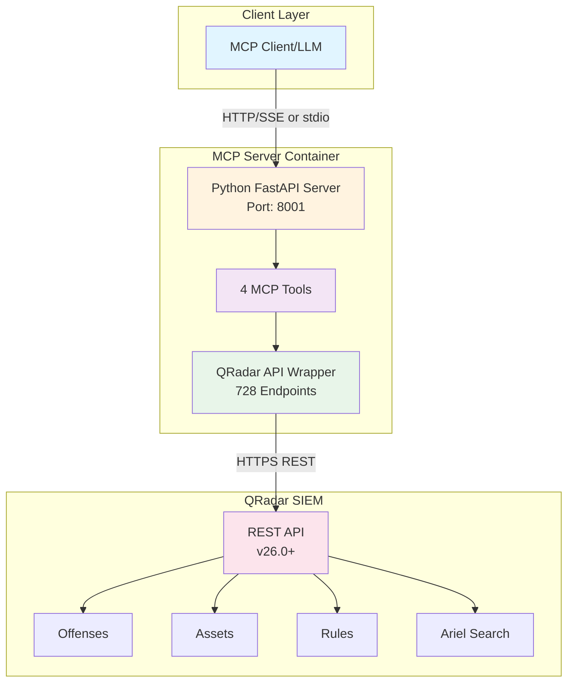

# QRadar MCP Server

**Model Context Protocol (MCP) server for IBM QRadar SIEM** - Access 728+ QRadar REST API endpoints through just 4 intelligent MCP tools.

---

## 🎯 What is This?

QRadar MCP Server bridges the gap between **Large Language Models (LLMs)** and **IBM QRadar SIEM**. It enables natural language interactions with your security data—no need to memorize 728 API endpoints.

### The Problem
- QRadar has **728+ REST API endpoints** — overwhelming for developers and LLMs alike
- Traditional approach: Define each endpoint as a separate tool → **massive token consumption**
- Result: Expensive API calls, slow responses, context limits exceeded

### The Solution
Instead of exposing 728 tools, we expose **just 4 intelligent tools**:

| Traditional Approach | MCP Server Approach |
|---------------------|---------------------|
| 728 tool definitions | **4 tool definitions** |
| ~50,000 tokens/request | **~2,000 tokens/request** |
| Context overflow risk | Fits any LLM context |
| Slow tool discovery | Instant endpoint lookup |

### Token Efficiency
- **96% reduction** in tool definition tokens
- **25x faster** LLM processing
- Works with any LLM (Claude, GPT, Gemini, Llama)

### Who Should Use This?
- **Security analysts** wanting natural language QRadar queries
- **DevOps teams** automating security workflows
- **AI developers** building QRadar-integrated applications
- **SOC teams** needing quick incident data access

---

## 🌐 Experience It Live

### IBM MCP Client (Web UI)
Try the full experience with our React + FastAPI client:

**Demo URL:** [http://9.30.147.112:8000](http://9.30.147.112:8000)

> Ask questions like: *"Show me top 10 offenses"*, *"How many assets do we have?"*, *"Get system version"*

---

## 🏗️ Architecture


```mermaid
graph TB
    subgraph "Client Layer"
        A[MCP Client/LLM] 
    end
    
    subgraph "MCP Server Container"
        B[Python FastAPI Server<br/>Port: 8001]
        C[4 MCP Tools]
        D[QRadar API Wrapper<br/>728 Endpoints]
    end
    
    subgraph "QRadar SIEM"
        E[REST API<br/>v26.0+]
        F[Offenses]
        G[Assets]
        H[Rules]
        I[Ariel Search]
    end
    
    A -->|HTTP/SSE or stdio| B
    B --> C
    C --> D
    D -->|HTTPS REST| E
    E --> F
    E --> G
    E --> H
    E --> I
    
    style A fill:#e1f5ff
    style B fill:#fff3e0
    style C fill:#f3e5f5
    style D fill:#e8f5e9
    style E fill:#fce4ec
```

## 📦 What's Inside

### 4 Intelligent Tools
| Tool | Description | Example |
|------|-------------|---------|
| `qradar_get` | Fetch data from 728 endpoints | Get offenses, assets, rules |
| `qradar_execute` | Create/update resources | Create reference sets, update rules |
| `qradar_delete` | Remove resources | Delete offense notes |
| `qradar_discover` | Auto-discover endpoints | Find correct API paths |

### Supported Endpoints (728 total)
- **SIEM:** Offenses, sources, destinations
- **Assets:** Asset model, vulnerabilities, compliance
- **Analytics:** Rules, building blocks, searches
- **Ariel:** AQL queries, searches, results
- **Reference Data:** Sets, maps, collections
- **Config:** Domains, log sources, users
- **System:** Health, licensing, servers

## 🚀 Quick Start

### Option 1: Pull from Registry (Run as Container)

```bash
# Pull multi-architecture image
docker pull ghcr.io/addanuj/qradar-mcp-server:latest

# Run as container
docker run -d \
  --name qradar-mcp-server \
  -p 8001:8001 \
  -e QRADAR_HOST="https://your-qradar-console.com" \
  -e QRADAR_API_TOKEN="your-sec-token-here" \
  -e QRADAR_VERIFY_SSL="false" \
  ghcr.io/addanuj/qradar-mcp-server:latest \
  --host 0.0.0.0 --port 8001
```

### Option 2: Build from Source (Run as Container)

```bash
# Clone repository
git clone https://github.ibm.com/ashrivastava/QRadar-MCP-Server.git
cd QRadar-MCP-Server

# Build container image
docker build -t qradar-mcp-server:latest -f container/Dockerfile .

# Run as container
docker run -d \
  --name qradar-mcp-server \
  -p 8001:8001 \
  -e QRADAR_HOST="https://your-qradar.com" \
  -e QRADAR_API_TOKEN="token" \
  qradar-mcp-server:latest \
  --host 0.0.0.0 --port 8001
```

### Option 3: Local Development (Run as Python Service)

```bash
# Install dependencies
pip install -e .

# Set environment variables
export QRADAR_HOST="https://your-qradar.com"
export QRADAR_API_TOKEN="your-token"

# Run in stdio mode (for Claude Desktop)
python -m src.server

# OR run in HTTP mode for local testing
python -m src.server --host 0.0.0.0 --port 8001
```

## 🔧 Configuration

### Environment Variables

| Variable | Required | Default | Description |
|----------|----------|---------|-------------|
| `QRADAR_HOST` | ✅ Yes | - | Full QRadar console URL (https://...) |
| `QRADAR_API_TOKEN` | ✅ Yes | - | QRadar API authorization token |
| `QRADAR_VERIFY_SSL` | ❌ No | `false` | Verify SSL certificates |
| `QRADAR_API_VERSION` | ❌ No | `26.0` | QRadar API version |

### Runtime Modes

#### HTTP/SSE Mode (Recommended for Containers)
```bash
python -m src.server --host 0.0.0.0 --port 8001
```
- Exposes REST API on port 8001
- Health check: `http://localhost:8001/health`
- Tools list: `http://localhost:8001/tools`
- SSE streaming support

#### stdio Mode (for Claude Desktop)
```bash
python -m src.server
```
- Communicates via stdin/stdout
- Use in Claude Desktop MCP configuration
- No network exposure needed

##  Usage Examples

### Check Server Health
```bash
curl http://localhost:8001/health
# Response: {"status":"healthy","mode":"http","tools":4,"endpoints":728}
```

### List Available Tools
```bash
curl http://localhost:8001/tools
```

### Call a Tool (Get Offenses)
```bash
curl -X POST http://localhost:8001/tools/call \
  -H "Content-Type: application/json" \
  -d '{
    "name": "qradar_get",
    "arguments": {
      "endpoint": "/siem/offenses",
      "limit": 10,
      "qradar_host": "https://your-qradar.com",
      "qradar_token": "your-token"
    }
  }'
```

### Discover Endpoints
```bash
curl -X POST http://localhost:8001/tools/call \
  -H "Content-Type: application/json" \
  -d '{
    "name": "qradar_discover",
    "arguments": {
      "search": "offenses",
      "qradar_host": "https://your-qradar.com",
      "qradar_token": "your-token"
    }
  }'
```

## 📁 Project Structure

```
QRadar-MCP-Server/
├── container/
│   └── Dockerfile              # Multi-arch container definition
├── src/
│   ├── __init__.py
│   ├── __main__.py            # Entry point
│   ├── server.py              # FastAPI server (HTTP mode)
│   ├── client.py              # QRadar API client wrapper
│   └── tools.py               # 4 MCP tools with 728 endpoint definitions
└── pyproject.toml             # Python package config
```

## 🚦 Supported QRadar Versions

- QRadar 7.3.x ✅ (tested)
- QRadar 7.4.x ✅ (tested)
- QRadar 7.5.x ✅ (tested)

## 📞 Support

### Reporting Issues & Feature Requests

**Found a bug?**
1. Go to: https://github.ibm.com/ashrivastava/QRadar-MCP-Server/issues
2. Click **"New Issue"**
3. Provide: clear title, steps to reproduce, QRadar version, and logs (`docker logs qradar-mcp-server`)

**Have a suggestion?**
1. Open issue with **[Feature Request]** prefix
2. Describe use case and expected behavior

**Need help?**
- Check logs: `docker logs qradar-mcp-server`
- Search existing issues: https://github.ibm.com/ashrivastava/QRadar-MCP-Server/issues
- Contact: ashrivastava@ibm.com

---

## ⚠️ Disclaimer

**This is a Minimum Viable Product (MVP) for testing and demonstration purposes only.**

- **NOT for production use**
- **No warranty or support guarantees**
- **Use at your own risk**
- For production deployments, conduct thorough security review and testing
- IBM is not responsible for any issues arising from the use of this software
