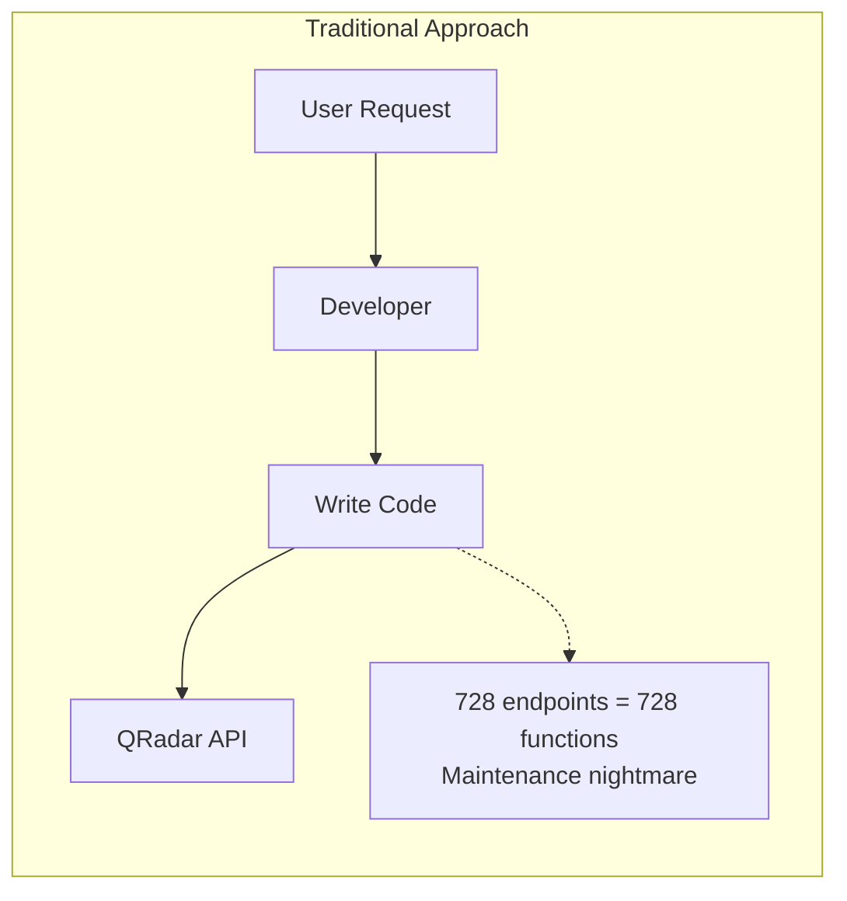
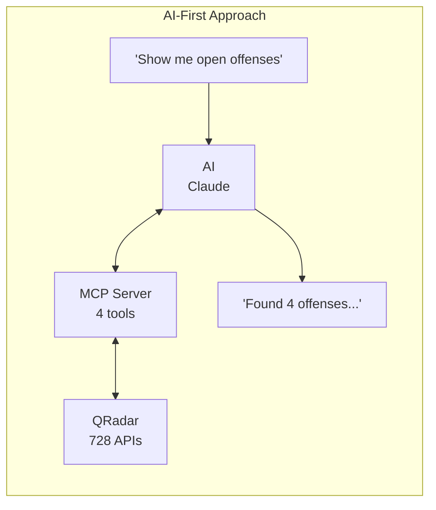
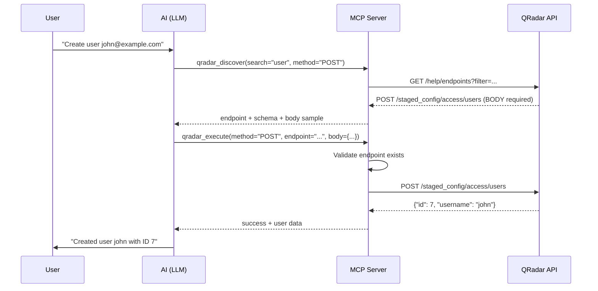

# QRadar MCP Server

**4 AI Tools → 728 QRadar API Endpoints**

## The Problem

Traditional QRadar integrations require:
- Writing code for each of the 728 API endpoints
- Maintaining endpoint-specific logic
- Manual parameter handling and error management
- Developers who understand both QRadar API and coding


```mermaid
flowchart LR
    subgraph Traditional["Traditional Approach"]
        U[User Request] --> D[Developer]
        D --> C[Write Code]
        C --> Q[QRadar API]
        C -.-> M["728 endpoints = 728 functions<br/>Maintenance nightmare"]
    end
```

## The Solution

Let AI handle the complexity. We built an MCP server with just **4 generic tools** that cover all 728 endpoints:

| Tool | Coverage | Purpose |
|------|----------|---------|
| `qradar_get` | 414 endpoints | Fetch any data |
| `qradar_execute` | 227 endpoints | Create/Update anything |
| `qradar_delete` | 87 endpoints | Delete any resource |
| `qradar_discover` | Schema lookup | Find endpoints + parameters |


```mermaid
flowchart LR
    subgraph AI-First["AI-First Approach"]
        User["'Show me open offenses'"] --> AI[AI<br/>Claude]
        AI <--> MCP[MCP Server<br/>4 tools]
        MCP <--> QRadar[QRadar<br/>728 APIs]
        AI --> Response["'Found 4 offenses...'"]
    end
```

## How It Works


```mermaid
sequenceDiagram
    participant User
    participant AI as AI (LLM)
    participant MCP as MCP Server
    participant QRadar as QRadar API

    User->>AI: "Create user john@example.com"
    
    AI->>MCP: qradar_discover(search="user", method="POST")
    MCP->>QRadar: GET /help/endpoints?filter=...
    QRadar-->>MCP: POST /staged_config/access/users (BODY required)
    MCP-->>AI: endpoint + schema + body sample
    
    AI->>MCP: qradar_execute(method="POST", endpoint="...", body={...})
    MCP->>MCP: Validate endpoint exists
    MCP->>QRadar: POST /staged_config/access/users
    QRadar-->>MCP: {"id": 7, "username": "john"}
    MCP-->>AI: success + user data
    
    AI->>User: "Created user john with ID 7"
```

## Key Innovation

**More AI, Less Code:**

| Aspect | Traditional | This MCP Server |
|--------|-------------|-----------------|
| Endpoints covered | 1 function per endpoint | 4 tools for all |
| Schema knowledge | Hardcoded | AI discovers via `/help/endpoints` |
| Error handling | Per-endpoint | Centralized validation |
| New endpoints | Write new code | Works automatically |
| Lines of code | ~50,000+ | ~500 |

The AI does the heavy lifting:
- Understands natural language requests
- Discovers correct endpoints dynamically
- Learns required parameters from schema
- Handles multi-step workflows

## Quick Start

```bash
# Setup
./setup.sh

# Configure
export QRADAR_HOST="https://your-qradar.com"
export QRADAR_API_TOKEN="your-token"

# Run
python3 -m src.server
```

## Project Structure

```
QRadar-MCP-Server-V2/
├── pyproject.toml      # Package config
├── requirements.txt    # Dependencies (mcp, httpx)
├── setup.sh            # Setup script
└── src/
    ├── __init__.py
    ├── __main__.py     # Entry point
    ├── client.py       # HTTP client for QRadar
    ├── server.py       # MCP server
    └── tools.py        # 4 tools implementation
```

## Example Queries

```
"Show me all open offenses"
"Create a reference set called Blocked_IPs"
"Add 192.168.1.100 to the Blocked_IPs set"
"Find all failed logins in the last hour"
"Create user john with email john@example.com"
"Close offense 1506 with reason Policy Violation"
```

## Dependencies

- Python 3.10+
- `mcp` - Model Context Protocol SDK
- `httpx` - Async HTTP client
