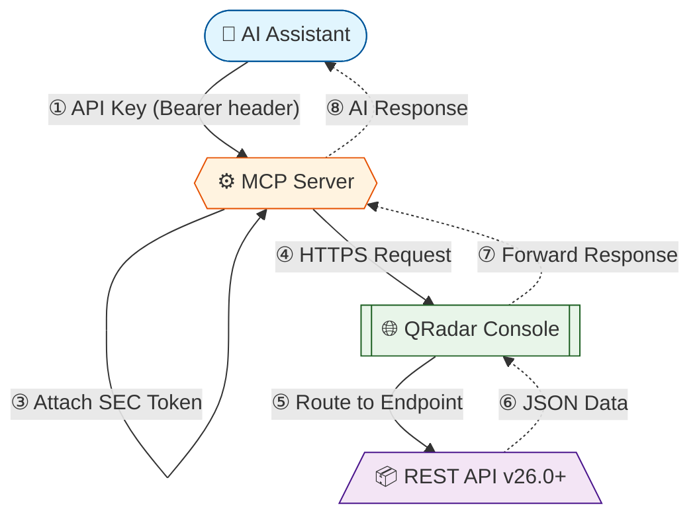
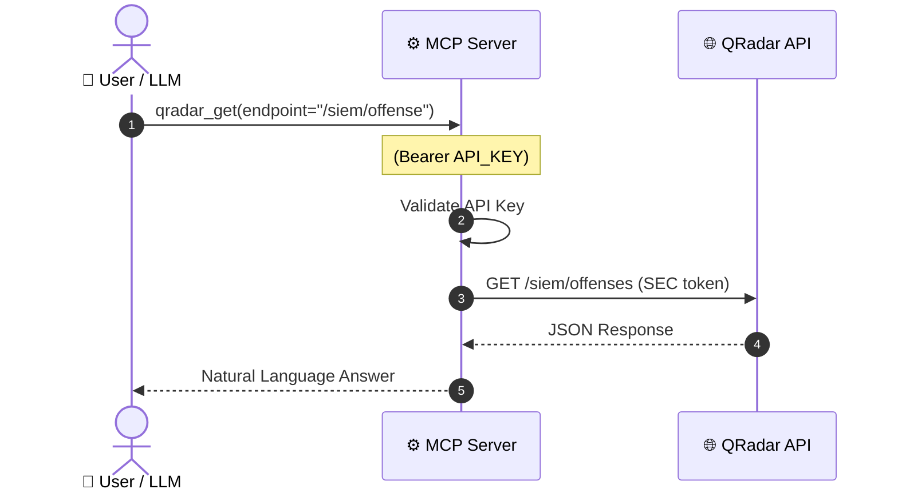
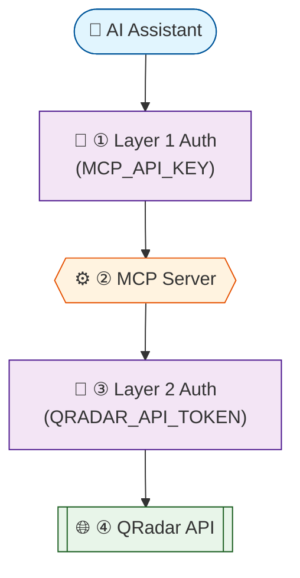

# QRadar MCP Server

**Model Context Protocol (MCP) server for IBM QRadar SIEM** — Access 728+ QRadar REST API endpoints through just 4 intelligent MCP tools.


---

## Table of Contents

- [Overview](#overview)
- [What You Can Do](#what-you-can-do)
- [Architecture](#architecture)
- [Getting Started](#getting-started)
- [MCP Client Configuration](#mcp-client-configuration)
- [Security](#security)
- [Using the MCP Server](#using-the-mcp-server)
- [Configuration Reference](#configuration-reference)
- [Build from Source](#build-from-source)
- [Resources](#resources)
- [Support](#support)
- [IBM Public Repository Disclosure](#ibm-public-repository-disclosure)

---

## Overview

QRadar MCP Server bridges **Large Language Models (LLMs)** and **IBM QRadar SIEM**. Instead of exposing 728 API endpoints as separate tools (which would overwhelm any LLM context window), this server consolidates them into **4 intelligent tools** — achieving a **96% reduction** in token usage.

| Traditional Approach | QRadar MCP Server |
|---------------------|-------------------|
| 728 tool definitions | **4 tool definitions** |
| ~50,000 tokens/request | **~2,000 tokens/request** |
| Context overflow risk | Fits any LLM context |

Works with any MCP-compatible client: Claude Desktop, IBM Bob, or custom AI agents.

### Supported QRadar API Categories (728 endpoints)

SIEM (offenses, sources, destinations) · Assets (model, vulnerabilities) · Analytics (rules, building blocks) · Ariel (AQL queries, searches) · Reference Data (sets, maps, collections) · Config (domains, log sources, users) · System (health, licensing, servers)

---

## What You Can Do

Ask your AI assistant to interact with QRadar SIEM using natural language — no API calls, no console navigation:

- *"Show me the top 10 open offenses"*
- *"Search for failed login events from external IPs in the last hour"*
- *"What assets are in my network inventory?"*
- *"Create an Ariel AQL search for DNS queries to suspicious domains"*
- *"List all active custom rules"*
- *"Add 192.168.1.100 to the suspicious IPs reference set"*
- *"What QRadar API endpoints are available for offense management?"*

Authentication happens automatically — the server uses your QRadar API token for every request. No credentials in your prompts, ever.

---

## Architecture

### How It Works


```mermaid
%%{init: {'theme': 'default'}}%%
flowchart TB
    A(["🤖 AI Assistant"])
    B{{"⚙️ MCP Server"}}
    D[["🌐 QRadar Console"]]
    QR[/"📦 REST API v26.0+"\]

    A -->|"① API Key (Bearer header)"| B
    B -->|② Validate API Key| B
    B -->|③ Attach SEC Token| B
    B -->|④ HTTPS Request| D
    D -->|⑤ Route to Endpoint| QR
    QR -.->|⑥ JSON Data| D
    D -.->|⑦ Forward Response| B
    B -.->|⑧ AI Response| A

    style A fill:#e1f5fe,stroke:#01579b
    style B fill:#fff3e0,stroke:#e65100
    style D fill:#e8f5e9,stroke:#1b5e20
    style QR fill:#f3e5f5,stroke:#4a148c
```

### Tool Workflow


```mermaid
sequenceDiagram
    autonumber
    actor U as 👤 User / LLM
    participant M as ⚙️ MCP Server
    participant Q as 🌐 QRadar API

    U->>M: qradar_get(endpoint="/siem/offense")
    Note over M: (Bearer API_KEY)
    M->>M: Validate API Key
    M->>Q: GET /siem/offenses (SEC token)
    Q-->>M: JSON Response
    M-->>U: Natural Language Answer
```

---

## Getting Started

### Prerequisites

- **Docker** or **Podman** installed
- **QRadar Console** with API access enabled

### Step 1: Gather Your Credentials

You need two tokens before starting the server:

**① QRadar SEC Token** (Layer 2) — get it from QRadar:

> QRadar Console → Admin → Authorized Services → Add → copy the token.

**② MCP API Key** (Layer 1) — generate it yourself:

```bash
openssl rand -base64 32
```

Save the output. You will set this value on the server **and** give the same value to your MCP clients. This is a shared secret — it only works if both sides have the identical key.

### Step 2: Login to Container Registry

The container image is hosted on a **private** GitHub registry. Login with the read-only token (get it from your MCP server admin):

```bash
echo "<GHCR_READ_TOKEN>" | docker login ghcr.io -u USERNAME --password-stdin
```

### Step 3: Pull and Run the Container

```bash
docker pull ghcr.io/ibm/qradar-mcp-server:latest

docker run -d \
  --name qradar-mcp \
  -p 8001:8001 \
  -e QRADAR_HOST="https://your-qradar-console.com" \
  -e QRADAR_API_TOKEN="<sec-token-from-step-1>" \
  -e QRADAR_VERIFY_SSL="false" \
  -e MCP_API_KEY="<api-key-from-step-1>" \
  ghcr.io/ibm/qradar-mcp-server:latest
```

> **Tip:** You can also use a `.env` file instead of `-e` flags. See [Configuration Reference](#configuration-reference) for all available variables.

### Step 4: Verify

```bash
curl http://localhost:8001/health
```

Expected response:

```json
{"status": "healthy", "mode": "http", "tools": 4, "endpoints": 728, "auth_required": true}
```

`"auth_required": true` confirms Layer 1 authentication is active.

---

## MCP Client Configuration

Your client needs the **MCP API Key** from Step 1 to authenticate with the server.

### Claude Desktop

Edit `~/Library/Application Support/Claude/claude_desktop_config.json`:

```json
{
  "mcpServers": {
    "qradar-mcp-server": {
      "command": "/opt/homebrew/bin/node",
      "args": [
        "/opt/homebrew/bin/mcp-remote",
        "http://<mcp-server-host>:8001/sse",
        "--header",
        "Authorization: Bearer <your-mcp-api-key>",
        "--allow-http"
      ]
    }
  }
}
```

> **Prerequisite:** Install `mcp-remote` once: `npm install -g mcp-remote`

### IBM Bob

Edit `~/Library/Application Support/IBM Bob/User/globalStorage/ibm.bob-code/settings/mcp_settings.json`:

```json
{
  "mcpServers": {
    "qradar-mcp-server": {
      "type": "sse",
      "url": "http://<mcp-server-host>:8001/sse",
      "headers": {
        "Authorization": "Bearer <your-mcp-api-key>"
      },
      "alwaysAllow": ["qradar_get", "qradar_execute", "qradar_delete", "qradar_discover"]
    }
  }
}
```

Replace `<mcp-server-host>` with the server hostname/IP and `<your-mcp-api-key>` with the MCP API Key you generated.

> **Tip:** Rotate the MCP API Key periodically by restarting the container with a new value and updating your clients.

---

## Security

The MCP server uses **two independent layers** of authentication. Both are secrets you create and control — they only work because you place the **same value** on the server and on the authorized party.


```mermaid
%%{init: {'theme': 'default'}}%%
flowchart TB
    A(["🤖 AI Assistant"])
    K1["🔐 ① Layer 1 Auth<br/>(MCP_API_KEY)"]
    B{{"⚙️ ② MCP Server"}}
    K2["🔑 ③ Layer 2 Auth<br/>(QRADAR_API_TOKEN)"]
    D[["🌐 ④ QRadar API"]]

    A --> K1 --> B --> K2 --> D

    style A fill:#e1f5fe,stroke:#01579b
    style K1 fill:#f3e5f5,stroke:#4a148c
    style B fill:#fff3e0,stroke:#e65100
    style K2 fill:#f3e5f5,stroke:#4a148c
    style D fill:#e8f5e9,stroke:#1b5e20
```

| Layer | What it protects | Who creates it | Where it lives | How it's used |
|-------|-----------------|----------------|----------------|---------------|
| **Layer 1 — MCP API Key** | The MCP server itself | **You** — generate a random string | `MCP_API_KEY` env var on the server | Client sends `Authorization: Bearer <key>` header. Server does an exact string match. If unset, the server is open. |
| **Layer 2 — QRadar SEC Token** | QRadar's REST API | **QRadar Admin** — created in the QRadar Console | `QRADAR_API_TOKEN` env var on the server | Server attaches `SEC: <token>` header to every QRadar API call. |

**How Layer 1 works in practice:**

1. You generate a random key: `openssl rand -base64 32` → produces a unique 256-bit string.
2. You set it as `MCP_API_KEY` on the server (via env var or `.env` file).
3. You give the **same key** to each authorized MCP client (Claude Desktop, IBM Bob, etc.).
4. On every request, the server compares the client's `Authorization: Bearer <key>` header against `MCP_API_KEY`. If they don't match — **access denied**.

> The key is a shared secret between you (the server admin) and your authorized clients. Someone else running `openssl rand -base64 32` on their own machine gets a completely different random string — it will not match your server's key.

---

## Using the MCP Server

### Available Tools

| Tool | Description | Use For |
|------|-------------|---------|
| `qradar_get` | Fetch data from any endpoint | Get offenses, assets, rules, searches |
| `qradar_execute` | Create or update resources | Create reference sets, post notes |
| `qradar_delete` | Remove resources | Delete notes, reference data |
| `qradar_discover` | Find the right endpoint | Search 728 endpoints by keyword |

### HTTP API Examples

**Discover endpoints:**

```bash
curl -X POST http://localhost:8001/tools/call \
  -H "Content-Type: application/json" \
  -H "Authorization: Bearer <your-mcp-api-key>" \
  -d '{
    "name": "qradar_discover",
    "arguments": {"search": "offenses"}
  }'
```

**Get recent offenses:**

```bash
curl -X POST http://localhost:8001/tools/call \
  -H "Content-Type: application/json" \
  -H "Authorization: Bearer <your-mcp-api-key>" \
  -d '{
    "name": "qradar_get",
    "arguments": {"endpoint": "/siem/offenses", "limit": 10}
  }'
```

**List all tools:**

```bash
curl http://localhost:8001/tools \
  -H "Authorization: Bearer <your-mcp-api-key>"
```

---

## Configuration Reference

### Environment Variables

| Variable | Required | Default | Description |
|----------|----------|---------|-------------|
| `QRADAR_HOST` | Yes | — | QRadar console URL (e.g., `https://qradar.example.com`) |
| `QRADAR_API_TOKEN` | Yes | — | QRadar authorized service token (Layer 2) |
| `QRADAR_VERIFY_SSL` | No | `false` | Verify SSL certificates |
| `QRADAR_API_VERSION` | No | `26.0` | QRadar API version |
| `MCP_API_KEY` | Yes for HTTP | — | API key for MCP server access (Layer 1). Clients must send `Authorization: Bearer <key>`. If unset, HTTP MCP routes return 401 (fail closed). |

**Example `.env` file:**

```env
QRADAR_HOST=https://<your-qradar-host>
QRADAR_API_TOKEN=<your-qradar-api-token>
QRADAR_API_VERSION=26.0
QRADAR_VERIFY_SSL=false
MCP_API_KEY=<generated-api-key>
```

### Runtime Modes

| Mode | Flag | Use Case |
|------|------|----------|
| HTTP/SSE (default) | `--host 0.0.0.0 --port 8001` | Containers, web clients, direct API |
| stdio | `--stdio` | Claude Desktop, local CLI tools |

---

## Build from Source

```bash
git clone https://github.com/IBM/qradar-mcp-server.git
cd qradar-mcp-server

# Build container
docker build -t qradar-mcp-server -f container/Dockerfile .

# Run
docker run -d --name qradar-mcp -p 8001:8001 \
  -e QRADAR_HOST="https://your-qradar.com" \
  -e QRADAR_API_TOKEN="your-token" \
  -e MCP_API_KEY="your-api-key" \
  qradar-mcp-server
```

---

## Resources

- [IBM QRadar SIEM Documentation](https://www.ibm.com/docs/en/qsip)
- [QRadar REST API Reference](https://www.ibm.com/docs/en/qsip/7.5?topic=versions-rest-api-v260-reference)

---

## Contact

**Maintainer:** Anuj Shrivastava — AI Engineer, US Industry Market - Service Engineering

📧 [ashrivastava@in.ibm.com](mailto:ashrivastava@in.ibm.com)

For demos, integration help, or collaboration — reach out via email.

---

## Support

**Found a bug?**

- Open an issue at [github.com/IBM/qradar-mcp-server/issues](https://github.com/IBM/qradar-mcp-server/issues)
- Provide: steps to reproduce, environment details, and relevant logs
- Include log snippets: `docker logs qradar-mcp`

**Need help?**

- Check container logs: `docker logs qradar-mcp`

---

## IBM Public Repository Disclosure

All content in this repository including code has been provided by IBM under the associated open source software license and IBM is under no obligation to provide enhancements, updates, or support. IBM developers produced this code as an open source project (not as an IBM product), and IBM makes no assertions as to the level of quality nor security, and will not be maintaining this code going forward.
