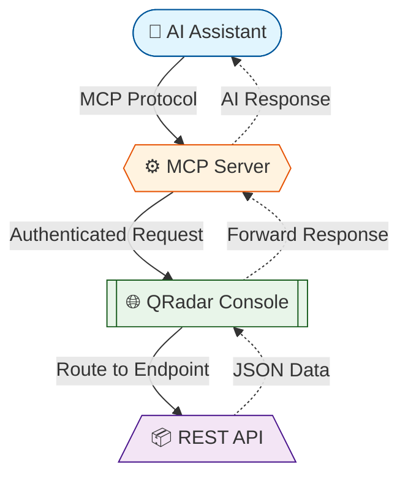
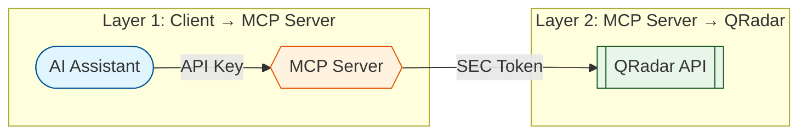

# QRadar MCP Server

Let AI agents investigate security incidents, query offenses, run AQL searches, and manage threat intelligence — all through natural language.

## What You Can Do

- **Investigate security offenses** — ask "show me all critical offenses from the last 24 hours" and get instant triage with source IPs, event counts, and severity
- **Run AQL queries in plain English** — translate business questions into QRadar's Ariel Query Language without knowing AQL syntax
- **Manage reference sets** — update blocklists, allowlists, and threat intelligence feeds through conversation
- **Accelerate incident response** — correlate events, identify attack patterns, and build investigation timelines in seconds instead of hours

## Compatible With

IBM Bob · Claude Desktop · VS Code Copilot · watsonx Orchestrate · Any MCP-compatible AI assistant

---

## Architecture

```mermaid
%%{init: {'theme': 'default'}}%%
flowchart TB
    A(["🤖 AI Assistant"])
    B{{"⚙️ MCP Server"}}
    D[["🌐 QRadar Console"]]
    QR[/"📦 REST API"\]

    A -->|"MCP Protocol"| B
    B -->|"Authenticated Request"| D
    D -->|"Route to Endpoint"| QR
    QR -.->|"JSON Data"| D
    D -.->|"Forward Response"| B
    B -.->|"AI Response"| A

    style A fill:#e1f5fe,stroke:#01579b
    style B fill:#fff3e0,stroke:#e65100
    style D fill:#e8f5e9,stroke:#1b5e20
    style QR fill:#f3e5f5,stroke:#4a148c
```

## Security

```mermaid
%%{init: {'theme': 'default'}}%%
flowchart LR
    subgraph "Layer 1: Client → MCP Server"
        A(["AI Assistant"]) -->|"API Key"| B{{"MCP Server"}}
    end

    subgraph "Layer 2: MCP Server → QRadar"
        B -->|"SEC Token"| D[["QRadar API"]]
    end

    style A fill:#e1f5fe,stroke:#01579b
    style B fill:#fff3e0,stroke:#e65100
    style D fill:#e8f5e9,stroke:#1b5e20
```

---

## Contact

**Maintainer:** Anuj Shrivastava — AI Engineer, US Industry Market - Service Engineering

📧 [ashrivastava@ibm.com](mailto:ashrivastava@ibm.com)

For demos, integration help, or collaboration — reach out via email.

> **Disclaimer:** This is a Minimum Viable Product (MVP) for testing and demonstration purposes only. Not for production use. No warranty or support guarantees.

## IBM Public Repository Disclosure

All content in this repository including code has been provided by IBM under the associated open source software license and IBM is under no obligation to provide enhancements, updates, or support. IBM developers produced this code as an open source project (not as an IBM product), and IBM makes no assertions as to the level of quality nor security, and will not be maintaining this code going forward.
