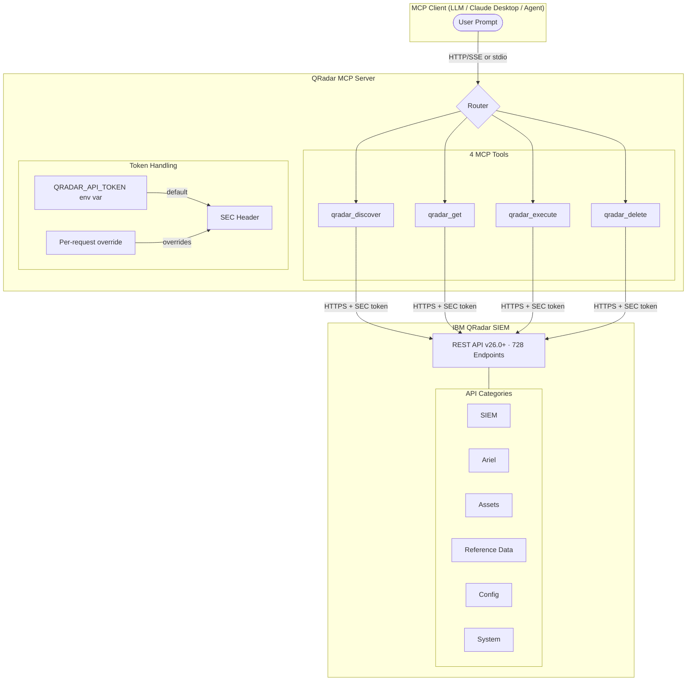
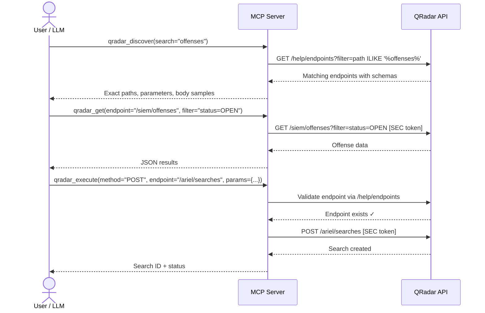

# QRadar MCP Server

**Model Context Protocol (MCP) server for IBM QRadar SIEM** — Access 728+ QRadar REST API endpoints through just 4 intelligent MCP tools.


---

## What is This?

QRadar MCP Server bridges **Large Language Models (LLMs)** and **IBM QRadar SIEM**. Instead of exposing 728 API endpoints as separate tools (which would overwhelm any LLM context window), this server consolidates them into **4 intelligent tools** — achieving a **96% reduction** in token usage.

| Traditional Approach | QRadar MCP Server |
|---------------------|-------------------|
| 728 tool definitions | **4 tool definitions** |
| ~50,000 tokens/request | **~2,000 tokens/request** |
| Context overflow risk | Fits any LLM context |

Works with any MCP-compatible client: Claude Desktop, IBM Bob, VS Code (GitHub Copilot), or custom AI agents.

---

## What You Can Do

Ask your AI assistant to interact with QRadar SIEM using natural language — no API calls, no console navigation:

- *"Show me the top 10 open offenses"*
- *"Search for failed login events from external IPs in the last hour"*
- *"What assets are in my network inventory?"*
- *"Create an Ariel AQL search for DNS queries to suspicious domains"*
- *"List all active custom rules"*
- *"Add 192.168.1.100 to the suspicious IPs reference set"*
- *"What QRadar API endpoints are available for offense management?"*

Authentication happens automatically — the server uses your QRadar API token for every request. No credentials in your prompts, ever.

---

## Getting Started

> 📖 [Full Setup Guide](qradar-mcp-server-e2e-setup-guide.md) — Complete step-by-step instructions for server admins and clients, including deployment, client onboarding for Claude Desktop, VS Code, and IBM Bob, key rotation, and troubleshooting.

### Quick Start (Admin)

### Prerequisites

- **Docker** or **Podman** installed
- **QRadar Console** with API access enabled
- **QRadar API Token** — get it from: QRadar Console → Admin → Authorized Services → Add

### Step 1: Pull the Container

```bash
docker pull ghcr.io/ibm/qradar-mcp-server:latest
```

> Multi-arch image — works on Intel/AMD (x86_64) and Apple Silicon/ARM (aarch64).

### Step 2: Run the Container

```bash
docker run -d \
  --name qradar-mcp \
  -p 8001:8001 \
  -e QRADAR_HOST="https://your-qradar-console.com" \
  -e QRADAR_API_TOKEN="your-api-token" \
  -e QRADAR_VERIFY_SSL="false" \
  -e MCP_API_KEY="$(openssl rand -base64 32)" \
  -e OAUTH_JWT_SECRET="$(openssl rand -base64 32)" \
  -e OAUTH_PASSWORD="your-oauth-password" \
  ghcr.io/ibm/qradar-mcp-server:latest
```

Replace:

- `your-qradar-console.com` with your QRadar console hostname
- `your-api-token` with your QRadar authorized service token

### Step 3: Verify

```bash
curl http://localhost:8001/health
```

Expected response:

```json
{"status": "healthy", "mode": "http", "tools": 4, "endpoints": 728, "auth_required": true, "oauth_enabled": true}
```

That's it — the MCP server is running and ready to use.

### Quick Start (Client)

Get the server URL and login credentials from your admin. Add to `.vscode/mcp.json` in your project root:

```json
{
  "servers": {
    "qradar-mcp-server": {
      "type": "sse",
      "url": "http://<mcp-server-host>:8001/sse"
    }
  }
}
```

Reload VS Code (`Cmd+Shift+P` → **Reload Window**). See the [Setup Guide](qradar-mcp-server-e2e-setup-guide.md) for Claude Desktop and IBM Bob configuration.

---

## Using the MCP Server

### Available Tools

| Tool | Description | Use For |
|------|-------------|---------|
| `qradar_get` | Fetch data from any endpoint | Get offenses, assets, rules, searches |
| `qradar_execute` | Create or update resources | Create reference sets, post notes |
| `qradar_delete` | Remove resources | Delete notes, reference data |
| `qradar_discover` | Find the right endpoint | Search 728 endpoints by keyword |

### HTTP API Examples

**Discover endpoints:**

```bash
curl -X POST http://localhost:8001/tools/call \
  -H "Content-Type: application/json" \
  -d '{
    "name": "qradar_discover",
    "arguments": {"search": "offenses"}
  }'
```

**Get recent offenses:**

```bash
curl -X POST http://localhost:8001/tools/call \
  -H "Content-Type: application/json" \
  -d '{
    "name": "qradar_get",
    "arguments": {"endpoint": "/siem/offenses", "limit": 10}
  }'
```

**List all tools:**

```bash
curl http://localhost:8001/tools
```

### With Claude Desktop (stdio Mode)

Add to your Claude Desktop MCP config (`~/Library/Application Support/Claude/claude_desktop_config.json`):

```json
{
  "mcpServers": {
    "qradar": {
      "command": "docker",
      "args": [
        "run", "-i", "--rm",
        "-e", "QRADAR_HOST=https://your-qradar-console.com",
        "-e", "QRADAR_API_TOKEN=your-api-token",
        "-e", "QRADAR_VERIFY_SSL=false",
        "ghcr.io/ibm/qradar-mcp-server:latest",
        "--stdio"
      ]
    }
  }
}
```

Then ask Claude things like:

- *"Show me the top 10 open offenses"*
- *"What assets are in my network?"*
- *"Search for failed login events in the last hour"*

---

## Configuration

### Environment Variables

| Variable | Required | Default | Description |
|----------|----------|---------|-------------|
| `QRADAR_HOST` | Yes | — | QRadar console URL (e.g., `https://qradar.example.com`) |
| `QRADAR_API_TOKEN` | Yes | — | QRadar authorized service token |
| `QRADAR_VERIFY_SSL` | No | `false` | Verify SSL certificates |
| `QRADAR_API_VERSION` | No | `26.0` | QRadar API version |
| `MCP_API_KEY` | No | — | API key for HTTP mode (clients must send `Authorization: Bearer <key>`) |
| `OAUTH_JWT_SECRET` | No | — | Secret for signing JWT tokens. Set to enable OAuth 2.1. Generate: `openssl rand -base64 32` |
| `OAUTH_USERNAME` | No | `admin` | Username for the OAuth login page |
| `OAUTH_PASSWORD` | No | — | Password for the OAuth login page. Required if `OAUTH_JWT_SECRET` is set |

### Runtime Modes

| Mode | Flag | Use Case |
|------|------|----------|
| HTTP/SSE (default) | `--host 0.0.0.0 --port 8001` | Containers, web clients, direct API |
| stdio | `--stdio` | Claude Desktop, local CLI tools |

---

## Security

The MCP server has three layers of authentication:

| Layer | Purpose | How it works |
|-------|---------|-------------|
| **Layer 1 — MCP API Key** | Quick static auth for trusted clients | Client sends `Authorization: Bearer <key>` header. Server validates against `MCP_API_KEY`. |
| **Layer 2 — OAuth 2.1** | Full MCP spec compliance (RFC 8414, RFC 7591, PKCE) | Dynamic client registration → browser-based login → JWT access tokens with 1h expiry + refresh token rotation. |
| **Layer 3 — QRadar SEC Token** | Authenticates the MCP server to QRadar's REST API | Server attaches `SEC: <token>` header to every QRadar API call. Set via `QRADAR_API_TOKEN` env var. |

Layers 1 and 2 are **dual-mode** — the server accepts both static API keys and OAuth JWT tokens. Existing clients using `Authorization: Bearer <api-key>` continue to work unchanged.

### OAuth 2.1 Flow (Layer 2)

```
Client → GET /sse                                    → 401 + WWW-Authenticate header
Client → GET /.well-known/oauth-authorization-server → metadata (endpoints, PKCE methods)
Client → POST /register                             → client_id + client_secret
Client → opens browser → /authorize?code_challenge=... → login page
User   → enters username/password
Client → POST /token (code + code_verifier)           → access_token (JWT, 1h) + refresh_token (7d)
Client → GET /sse + Bearer <access_token>             → connected ✓
```

To enable OAuth, set `OAUTH_JWT_SECRET` and `OAUTH_PASSWORD` environment variables. See [Configuration](#configuration).

> **stdio mode** (Claude Desktop local usage) is exempt from Layer 1/2 — the user runs the process locally with their own QRadar token; QRadar (Layer 3) is the security gate.

---

## Build from Source

```bash
git clone https://github.com/IBM/qradar-mcp-server.git
cd qradar-mcp-server

# Build container
docker build -t qradar-mcp-server -f container/Dockerfile .

# Run
docker run -d --name qradar-mcp -p 8001:8001 \
  -e QRADAR_HOST="https://your-qradar.com" \
  -e QRADAR_API_TOKEN="your-token" \
  qradar-mcp-server
```

---

## Architecture

### How It Works


```mermaid
flowchart TB
    subgraph CLIENT["MCP Client (LLM / Claude Desktop / Agent)"]
        U([User Prompt])
    end

    subgraph MCP["QRadar MCP Server"]
        direction TB
        T{Router}

        subgraph TOOLS["4 MCP Tools"]
            direction LR
            T1["qradar_discover"]
            T2["qradar_get"]
            T3["qradar_execute"]
            T4["qradar_delete"]
        end

        subgraph AUTH["Token Handling"]
            direction LR
            ENV["QRADAR_API_TOKEN env var"]
            ARG["Per-request override"]
            HDR["SEC Header"]
        end

        ENV -->|default| HDR
        ARG -->|overrides| HDR
    end

    subgraph QRADAR["IBM QRadar SIEM"]
        API["REST API v26.0+ · 728 Endpoints"]
        subgraph CATEGORIES["API Categories"]
            direction LR
            C1["SIEM"]
            C2["Ariel"]
            C3["Assets"]
            C4["Reference Data"]
            C5["Config"]
            C6["System"]
        end
    end

    U -->|"HTTP/SSE or stdio"| T
    T --> T1 & T2 & T3 & T4
    T1 & T2 & T3 & T4 -->|"HTTPS + SEC token"| API
    API --- CATEGORIES
```

### Tool Workflow


```mermaid
sequenceDiagram
    actor User as User / LLM
    participant MCP as MCP Server
    participant QR as QRadar API

    User->>MCP: qradar_discover(search="offenses")
    MCP->>QR: GET /help/endpoints?filter=path ILIKE '%offenses%'
    QR-->>MCP: Matching endpoints with schemas
    MCP-->>User: Exact paths, parameters, body samples

    User->>MCP: qradar_get(endpoint="/siem/offenses", filter="status=OPEN")
    MCP->>QR: GET /siem/offenses?filter=status=OPEN [SEC token]
    QR-->>MCP: Offense data
    MCP-->>User: JSON results

    User->>MCP: qradar_execute(method="POST", endpoint="/ariel/searches", params={...})
    MCP->>QR: Validate endpoint via /help/endpoints
    QR-->>MCP: Endpoint exists ✓
    MCP->>QR: POST /ariel/searches [SEC token]
    QR-->>MCP: Search created
    MCP-->>User: Search ID + status
```

### Supported QRadar API Categories (728 endpoints)

SIEM (offenses, sources, destinations) · Assets (model, vulnerabilities) · Analytics (rules, building blocks) · Ariel (AQL queries, searches) · Reference Data (sets, maps, collections) · Config (domains, log sources, users) · System (health, licensing, servers)

---

## Resources

- [IBM QRadar SIEM Documentation](https://www.ibm.com/docs/en/qsip)
- [QRadar REST API Reference](https://www.ibm.com/docs/en/qsip/7.5?topic=versions-rest-api-v260-reference)
- [Container Image on ghcr.io](https://github.com/orgs/IBM/packages/container/package/qradar-mcp-server)
- [Full Setup Guide](qradar-mcp-server-e2e-setup-guide.md)

---

## Support

**Found a bug?**

- Open an issue at [github.com/IBM/qradar-mcp-server/issues](https://github.com/IBM/qradar-mcp-server/issues)
- Provide: steps to reproduce, environment details, and relevant logs
- Include log snippets: `docker logs qradar-mcp`

**Need help?**

- Check container logs: `docker logs qradar-mcp`
- Contact: [ashrivastava@in.ibm.com](mailto:ashrivastava@in.ibm.com), [rahul.k.p@ibm.com](mailto:rahul.k.p@ibm.com)

---

## IBM Public Repository Disclosure

All content in this repository including code has been provided by IBM under the associated open source software license and IBM is under no obligation to provide enhancements, updates, or support. IBM developers produced this code as an open source project (not as an IBM product), and IBM makes no assertions as to the level of quality nor security, and will not be maintaining this code going forward.
