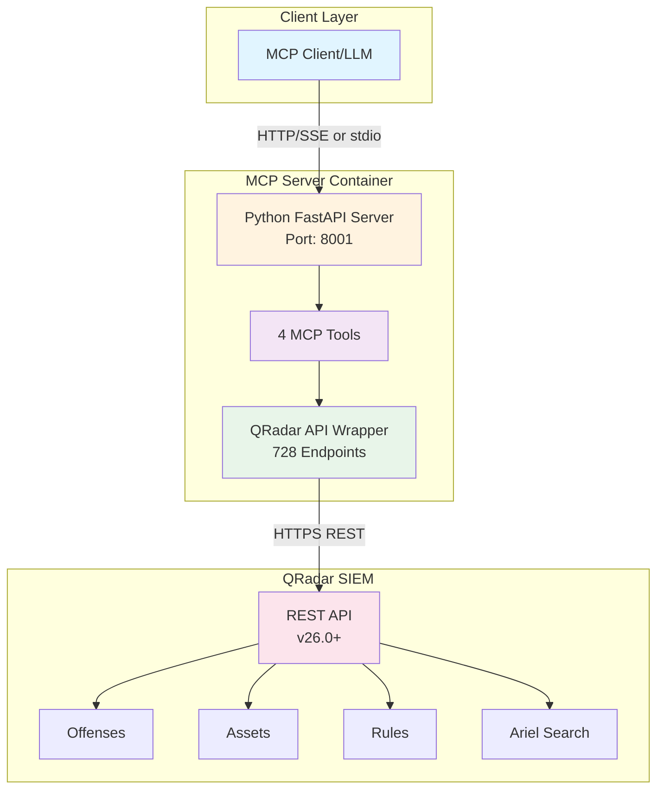

# QRadar MCP Server

**Model Context Protocol (MCP) server for IBM QRadar SIEM** - Provides 728+ QRadar REST API endpoints through 4 intelligent MCP tools.

## 🏗️ Architecture


```mermaid
graph TB
    subgraph "Client Layer"
        A[MCP Client/LLM] 
    end
    
    subgraph "MCP Server Container"
        B[Python FastAPI Server<br/>Port: 8001]
        C[4 MCP Tools]
        D[QRadar API Wrapper<br/>728 Endpoints]
    end
    
    subgraph "QRadar SIEM"
        E[REST API<br/>v26.0+]
        F[Offenses]
        G[Assets]
        H[Rules]
        I[Ariel Search]
    end
    
    A -->|HTTP/SSE or stdio| B
    B --> C
    C --> D
    D -->|HTTPS REST| E
    E --> F
    E --> G
    E --> H
    E --> I
    
    style A fill:#e1f5ff
    style B fill:#fff3e0
    style C fill:#f3e5f5
    style D fill:#e8f5e9
    style E fill:#fce4ec
```

## 📦 What's Inside

### 4 Intelligent Tools
| Tool | Description | Example |
|------|-------------|---------|
| `qradar_get` | Fetch data from 728 endpoints | Get offenses, assets, rules |
| `qradar_post` | Create/update resources | Create reference sets |
| `qradar_delete` | Remove resources | Delete offense notes |
| `qradar_discover` | Auto-discover endpoints | Find correct API paths |

### Supported Endpoints (728 total)
- **SIEM:** Offenses, sources, destinations
- **Assets:** Asset model, vulnerabilities, compliance
- **Analytics:** Rules, building blocks, searches
- **Ariel:** AQL queries, searches, results
- **Reference Data:** Sets, maps, collections
- **Config:** Domains, log sources, users
- **System:** Health, licensing, servers

## 🚀 Quick Start

### Option 1: Pull from Registry

```bash
# Pull multi-architecture image
docker pull ghcr.io/addanuj/qradar-mcp-server:latest

# Run with environment variables
docker run -d \
  --name qradar-mcp-server \
  -p 8001:8001 \
  -e QRADAR_HOST="https://your-qradar-console.com" \
  -e QRADAR_API_TOKEN="your-sec-token-here" \
  -e QRADAR_VERIFY_SSL="false" \
  ghcr.io/addanuj/qradar-mcp-server:latest \
  --host 0.0.0.0 --port 8001
```

### Option 2: Build from Source

```bash
# Clone repository
git clone https://github.ibm.com/ashrivastava/QRadar-MCP-Server.git
cd QRadar-MCP-Server

# Build container
docker build -t qradar-mcp-server:latest -f container/Dockerfile .

# Run
docker run -d \
  --name qradar-mcp-server \
  -p 8001:8001 \
  -e QRADAR_HOST="https://your-qradar.com" \
  -e QRADAR_API_TOKEN="token" \
  qradar-mcp-server:latest \
  --host 0.0.0.0 --port 8001
```

### Option 3: Local Development

```bash
# Install dependencies
pip install -e .

# Set environment variables
export QRADAR_HOST="https://your-qradar.com"
export QRADAR_API_TOKEN="your-token"

# Run in HTTP mode
python -m src.server --host 0.0.0.0 --port 8001

# OR Run in stdio mode (for Claude Desktop)
python -m src.server
```

## 🔧 Configuration

### Environment Variables

| Variable | Required | Default | Description |
|----------|----------|---------|-------------|
| `QRADAR_HOST` | ✅ Yes | - | Full QRadar console URL (https://...) |
| `QRADAR_API_TOKEN` | ✅ Yes | - | QRadar API authorization token |
| `QRADAR_VERIFY_SSL` | ❌ No | `false` | Verify SSL certificates |
| `QRADAR_API_VERSION` | ❌ No | `26.0` | QRadar API version |

### Runtime Modes

#### HTTP/SSE Mode (Recommended for Containers)
```bash
python -m src.server --host 0.0.0.0 --port 8001
```
- Exposes REST API on port 8001
- Health check: `http://localhost:8001/health`
- Tools list: `http://localhost:8001/tools`
- SSE streaming support

#### stdio Mode (for Claude Desktop)
```bash
python -m src.server
```
- Communicates via stdin/stdout
- Use in Claude Desktop MCP configuration
- No network exposure needed

## 🐳 Container Details

### Multi-Architecture Support
Images built for:
- **linux/amd64** - Intel/AMD x86_64 servers
- **linux/arm64** - Apple Silicon, ARM-based servers

### Container Registry
```bash
# GitHub Container Registry (public)
ghcr.io/addanuj/qradar-mcp-server:latest
```

### Dockerfile Structure
```dockerfile
FROM python:3.12-alpine          # Lightweight base
WORKDIR /app                     # Working directory
COPY pyproject.toml src/ ./      # Copy source
RUN pip install -e .             # Install package
EXPOSE 8001                      # HTTP port
ENTRYPOINT ["python", "-m", "src.server"]
```

### Build Multi-Arch Image
```bash
# Enable buildx
docker buildx create --use --name multiarch

# Build for both platforms
docker buildx build \
  --platform linux/amd64,linux/arm64 \
  -t ghcr.io/addanuj/qradar-mcp-server:latest \
  -f container/Dockerfile \
  --push .
```

## 🔍 Usage Examples

### Check Server Health
```bash
curl http://localhost:8001/health
# Response: {"status":"healthy","mode":"http","tools":4,"endpoints":728}
```

### List Available Tools
```bash
curl http://localhost:8001/tools
```

### Call a Tool (Get Offenses)
```bash
curl -X POST http://localhost:8001/tools/call \
  -H "Content-Type: application/json" \
  -d '{
    "name": "qradar_get",
    "arguments": {
      "endpoint": "/siem/offenses",
      "limit": 10,
      "qradar_host": "https://your-qradar.com",
      "qradar_token": "your-token"
    }
  }'
```

### Discover Endpoints
```bash
curl -X POST http://localhost:8001/tools/call \
  -H "Content-Type: application/json" \
  -d '{
    "name": "qradar_discover",
    "arguments": {
      "search": "offenses",
      "qradar_host": "https://your-qradar.com",
      "qradar_token": "your-token"
    }
  }'
```

## 📁 Project Structure

```
QRadar-MCP-Server/
├── container/
│   └── Dockerfile              # Multi-arch container definition
├── src/
│   ├── __init__.py
│   ├── __main__.py            # Entry point
│   ├── server.py              # FastAPI server (HTTP mode)
│   ├── client.py              # QRadar API client
│   └── tools/
│       ├── __init__.py
│       ├── siem.py            # SIEM endpoints (offenses, etc.)
│       ├── assets.py          # Asset management
│       ├── ariel.py           # AQL search engine
│       ├── config.py          # Configuration endpoints
│       ├── system.py          # System info
│       └── ...                # 20+ tool modules
└── pyproject.toml             # Python package config
```

## 🔐 Security Best Practices

### DO NOT Hardcode Credentials
❌ **Bad:**
```python
QRADAR_TOKEN = "4edfffda-86ee-..."  # Hardcoded
```

✅ **Good:**
```bash
export QRADAR_API_TOKEN="your-token"
docker run -e QRADAR_API_TOKEN=$QRADAR_API_TOKEN ...
```

### Use Secrets Management
```bash
# Docker secrets
echo "your-token" | docker secret create qradar_token -
docker service create --secret qradar_token ...

# Kubernetes secrets
kubectl create secret generic qradar-creds \
  --from-literal=token=your-token
```

### SSL Verification
For production:
```bash
-e QRADAR_VERIFY_SSL="true"
```

## 🐛 Troubleshooting

### Container Not Starting
```bash
# Check logs
docker logs qradar-mcp-server

# Common issues:
# - Missing QRADAR_HOST or QRADAR_API_TOKEN
# - Port 8001 already in use
# - QRadar console unreachable
```

### Connection Refused
```bash
# Test QRadar connectivity from container
docker exec qradar-mcp-server wget -O- https://your-qradar.com/api/system/about

# Check firewall rules
# Ensure container can reach QRadar on port 443
```

### 401 Unauthorized
```bash
# Verify token is valid
curl -H "SEC: your-token" https://your-qradar.com/api/system/about

# Regenerate token in QRadar:
# Admin → System Settings → Authorized Services
```

## 📊 Performance

- **Response Time:** < 2s for most endpoints
- **Concurrent Requests:** Supports 100+ simultaneous clients
- **Memory:** ~50MB base + 10MB per active connection
- **Startup Time:** < 2 seconds

## 🚦 Supported QRadar Versions

- QRadar 7.3.x
- QRadar 7.4.x
- QRadar 7.5.x ✅ (tested)
- QRadar on Cloud

## 📝 License

IBM Internal Use Only

## 🤝 Contributing

This is an internal IBM project. For access or questions, contact the QRadar MCP team.

## 🔗 Related Projects

- **IBM MCP Client** - React + FastAPI web interface for QRadar MCP
- **Claude Desktop MCP** - Use with Claude Desktop via stdio mode

## 📞 Support

For issues or questions:
1. Check logs: `docker logs qradar-mcp-server`
2. Review troubleshooting section
3. Contact: ashrivastava@ibm.com
