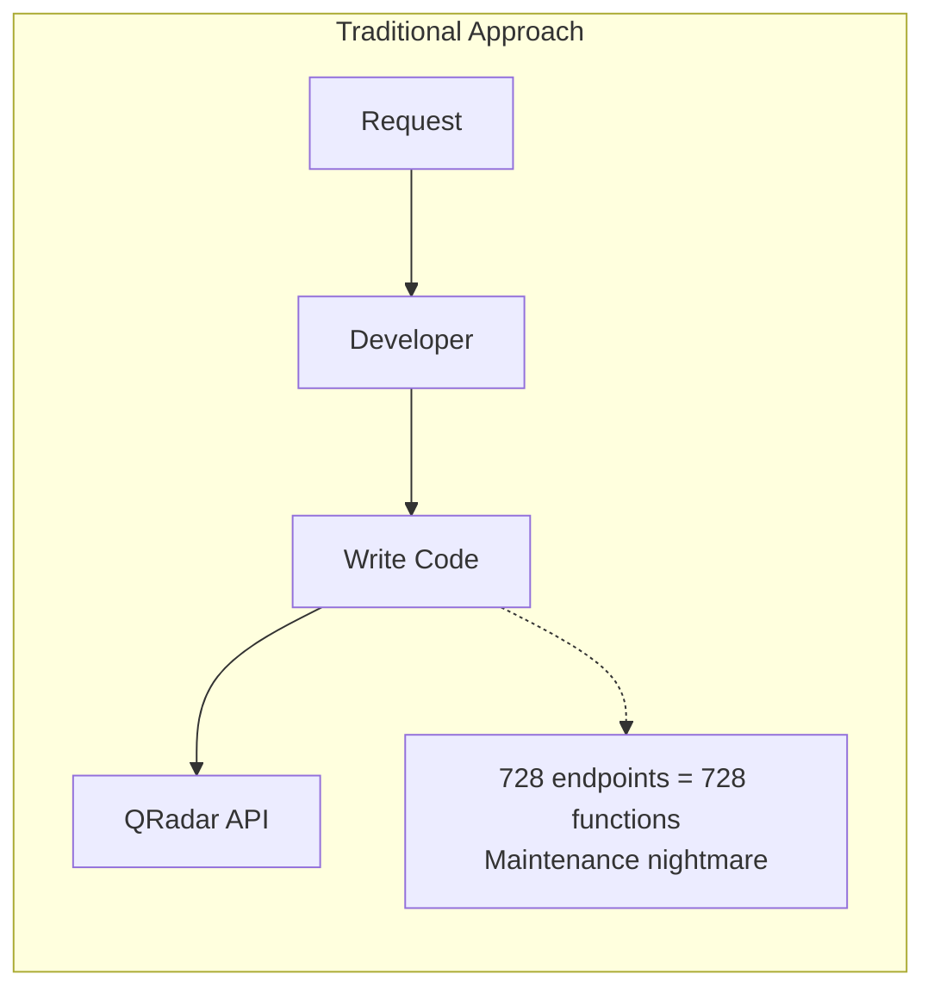
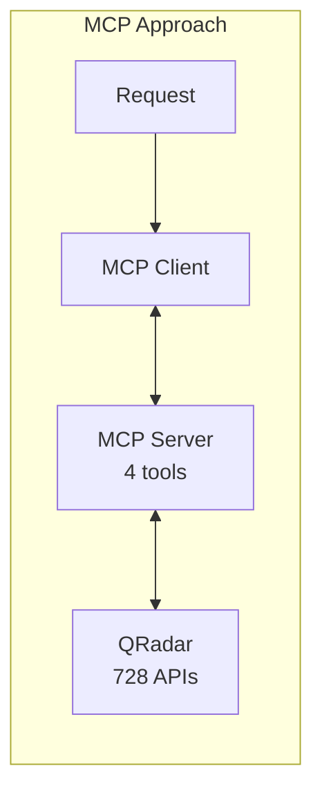
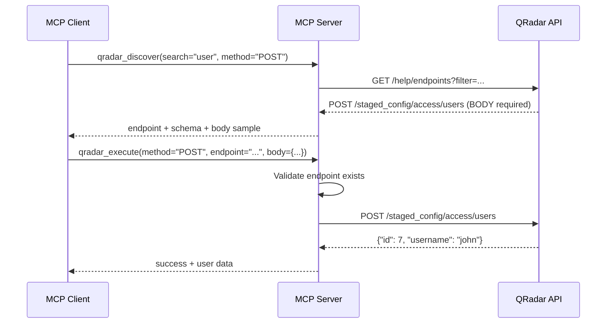

# QRadar MCP Server

**4 Generic Tools → 728 QRadar API Endpoints**

## The Problem

Traditional QRadar integrations are painful:

- **728 API endpoints** require writing and maintaining separate code for each
- **Hardcoded schemas** mean every API change requires code updates
- **No discoverability** - developers must read documentation to find the right endpoint
- **Endpoint-specific logic** scattered across thousands of lines of code
- **Parameter guessing** leads to 404 errors and failed integrations
- **High maintenance burden** - new QRadar versions break existing integrations

Organizations end up with:
- 50,000+ lines of boilerplate code
- Dedicated teams just for QRadar API maintenance
- Slow response to new security requirements
- Integration projects that take months instead of days

## The Solution

**Model Context Protocol (MCP)** enables a fundamentally different approach. Instead of writing code for each endpoint, we expose QRadar's entire API through **4 generic tools** that any MCP-compatible client can use.

| Tool | Coverage | Purpose |
|------|----------|---------|
| `qradar_get` | 414 endpoints | Fetch any data |
| `qradar_execute` | 227 endpoints | Create/Update anything |
| `qradar_delete` | 87 endpoints | Delete any resource |
| `qradar_discover` | Schema lookup | Find endpoints + parameters dynamically |

### Why MCP?

MCP (Model Context Protocol) is an open standard that enables:
- **Dynamic discovery** - clients learn available operations at runtime
- **Schema introspection** - parameter requirements returned by the server
- **Validation before execution** - invalid requests blocked before hitting QRadar
- **Universal compatibility** - works with any MCP client (IDEs, automation tools, LLM agents)


```mermaid
flowchart LR
    subgraph Traditional["Traditional Approach"]
        U[Request] --> D[Developer]
        D --> C[Write Code]
        C --> Q[QRadar API]
        C -.-> M["728 endpoints = 728 functions<br/>Maintenance nightmare"]
    end
```


```mermaid
flowchart LR
    subgraph MCP["MCP Approach"]
        Request["Request"] --> Client[MCP Client]
        Client <--> Server[MCP Server<br/>4 tools]
        Server <--> QRadar[QRadar<br/>728 APIs]
    end
```

## How It Works


```mermaid
sequenceDiagram
    participant Client as MCP Client
    participant Server as MCP Server
    participant QRadar as QRadar API

    Client->>Server: qradar_discover(search="user", method="POST")
    Server->>QRadar: GET /help/endpoints?filter=...
    QRadar-->>Server: POST /staged_config/access/users (BODY required)
    Server-->>Client: endpoint + schema + body sample
    
    Client->>Server: qradar_execute(method="POST", endpoint="...", body={...})
    Server->>Server: Validate endpoint exists
    Server->>QRadar: POST /staged_config/access/users
    QRadar-->>Server: {"id": 7, "username": "john"}
    Server-->>Client: success + user data
```

### Key Features

1. **Endpoint Validation** - Server verifies endpoint exists before calling QRadar
2. **Schema Discovery** - Returns required parameters and body samples
3. **Operation Categorization** - Identifies CREATE vs UPDATE vs DELETE operations
4. **Path Matching** - Correctly handles parameterized paths like `/offenses/{id}/notes`
5. **Error Prevention** - Blocks guessed/invalid endpoints with helpful suggestions

## Comparison

| Aspect | Traditional | MCP Server |
|--------|-------------|------------|
| Endpoints covered | 1 function per endpoint | 4 tools for all |
| Schema knowledge | Hardcoded | Discovered via `/help/endpoints` |
| Error handling | Per-endpoint | Centralized validation |
| New endpoints | Write new code | Works automatically |
| Lines of code | ~50,000+ | ~500 |
| Maintenance | High | Minimal |

## Quick Start

```bash
# Setup
./setup.sh

# Configure
export QRADAR_HOST="https://your-qradar.com"
export QRADAR_API_TOKEN="your-token"

# Run
python3 -m src.server
```

## Project Structure

```
QRadar-MCP-Server/
├── pyproject.toml      # Package config
├── requirements.txt    # Dependencies (mcp, httpx)
├── setup.sh            # Setup script
└── src/
    ├── __init__.py
    ├── __main__.py     # Entry point
    ├── client.py       # HTTP client for QRadar
    ├── server.py       # MCP server
    └── tools.py        # 4 tools implementation
```

## Example Operations

```
# List open offenses
qradar_get(endpoint="/siem/offenses", filter="status=OPEN")

# Create reference set
qradar_execute(method="POST", endpoint="/reference_data/sets", 
               params={"name": "Blocked_IPs", "element_type": "IP"})

# Add to reference set  
qradar_execute(method="POST", endpoint="/reference_data/sets/Blocked_IPs",
               params={"value": "192.168.1.100"})

# Search events with AQL
qradar_execute(method="POST", endpoint="/ariel/searches",
               params={"query_expression": "SELECT * FROM events LAST 1 HOURS"})

# Create user
qradar_execute(method="POST", endpoint="/staged_config/access/users",
               body={"username": "john", "email": "john@example.com", ...})
```

## Dependencies

- Python 3.10+
- `mcp` - Model Context Protocol SDK
- `httpx` - Async HTTP client
