# QRadar MCP Server

---

## Architecture

### How It Works

```mermaid
%%{init: {'theme': 'default'}}%%
flowchart TB
    A(["🤖 AI Assistant"])
    B{{"⚙️ MCP Server"}}
    D[["🌐 QRadar Console"]]
    QR[/"📦 REST API v26.0+"\]

    A -->|"① API Key (Bearer header)"| B
    B -->|② Validate API Key| B
    B -->|③ Attach SEC Token| B
    B -->|④ HTTPS Request| D
    D -->|⑤ Route to Endpoint| QR
    QR -.->|⑥ JSON Data| D
    D -.->|⑦ Forward Response| B
    B -.->|⑧ AI Response| A

    style A fill:#e1f5fe,stroke:#01579b
    style B fill:#fff3e0,stroke:#e65100
    style D fill:#e8f5e9,stroke:#1b5e20
    style QR fill:#f3e5f5,stroke:#4a148c
```

### Tool Workflow

## Security

```mermaid
%%{init: {'theme': 'default'}}%%
flowchart TB
    A(["🤖 AI Assistant"])
    K1["🔐 ① Layer 1 Auth<br/>(MCP_API_KEY)"]
    B{{"⚙️ ② MCP Server"}}
    K2["🔑 ③ Layer 2 Auth<br/>(QRADAR_API_TOKEN)"]
    D[["🌐 ④ QRadar API"]]

    A --> K1 --> B --> K2 --> D

    style A fill:#e1f5fe,stroke:#01579b
    style K1 fill:#f3e5f5,stroke:#4a148c
    style B fill:#fff3e0,stroke:#e65100
    style K2 fill:#f3e5f5,stroke:#4a148c
    style D fill:#e8f5e9,stroke:#1b5e20
```

---

## Contact

**Maintainer:** Anuj Shrivastava — AI Engineer, US Industry Market - Service Engineering

📧 [ashrivastava@ibm.com](mailto:ashrivastava@ibm.com)

For demos, integration help, or collaboration — reach out via email.

---

> **Disclaimer:** This is a Minimum Viable Product (MVP) for testing and demonstration purposes only. Not for production use. No warranty or support guarantees.

## IBM Public Repository Disclosure

All content in this repository including code has been provided by IBM under the associated open source software license and IBM is under no obligation to provide enhancements, updates, or support. IBM developers produced this code as an open source project (not as an IBM product), and IBM makes no assertions as to the level of quality nor security, and will not be maintaining this code going forward.
